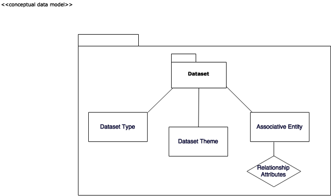

# Data Analyst Internship
 MTC Spatial Data Modeling Research and Data Internship  

This folder contains work products and research conducted by the 2017 Summer Intern  

## Repo Contents   

### Table of Content
 <ul>
 <li>Executive Summary</li>
 <li>Approach Plan</li>
 <li>Results</li>
 <li>Conceptual Model Development Draft</li>
 <li>Conclusion</li>
 <li>Case Studies</li>
</ul>

**************
### Executive Summary
**************
<table>
<tr><td>Integrated Planning Section at MTC uses and maintains an extensive library of data that is used to support variety of agency’s projects and initiatives. Data is currently spread between several databases, shared drives, box and personal drives in many different formats.  “By 2020 IDC” [International Data Corporation] “predicts the amount of digital information will grow by a factor of 30, the number of files, by a factor of 60”. MTS’s N-drive alone is holding more than half a million files and folders containing more the 60,000 datasets. Furthermore, “IDC surveys find that the time spent searching for information averages 8.8 hours per week.” Integrated planning section typically invests significant amount of time searching for data relevant to a particular project, initiative or task, as well as hires outside consultants to provide necessary data. The goal of this Data and Visualization Internship is to work with staff and develop a strategy for data discovery within the planning groups of the Air District, MTC and its transitional employees. That strategy is not to drastically change how things are done, but rather to improve and streamline data organization and dissemination process with clear understanding of the rules when it comes to data methodology to eliminate inefficiencies, efforts and costs associated with having relevant data.</td></tr></table>

***********
### Approach Plan
***********
<ul>
<li>Interview with the Head of the Department and at least one main Power Users to understand the need</li> 
<li>Schedule 15-30 minutes one-on-one interviews with the main data users to understand how they use data</li> 
<li>Analyze responses from one-on-one interviews to draw conclusions on the initial questions and methods to gather information about datasets</li> 
<li>Investigate option for publishing survey: google forms, survey monkey, in-house webform</li>
<li>Design and Build Survey Form</li>
<li>Sent out initial survey as an in-house web form and as excel template providing incentive such as prize to complete with in shorter timeframe</li>
<li>Schedule short one-on-one interviews with all users that didn’t respond to the survey</li> 
<li>Gather and document feedback on the Initial Data Survey</li> 
<li>Analyze at least one source of data files that participants frequently referred to as location to evaluate whether or not comprehensive inventory of all data files/datasets is valuable</li>
<li>Draw Conceptual Data Model </li>
<li>Suggestions for Data Submission Form</li>
<li>Write up Data Strategy Document</li>
<li>Finalized the project</li>
</ul>

***********
### Results
***********
</img>  

 Webform http://datasurvey.mtcanalytics.org/
  

Intiial participation in the data survey was 28% due to high volume of existing tasks and datasets. Low priority level of the survey also influenced low participation. 

***********
### Conceptual Data Model Draft
***********
  
 </img>

***********
### Conclusion
***********
With the information gathered via web survey, excel template, emails, in-person interviews and the "drive-by"s, it is concluded that due to high volume of existing data and tasks it will be beneficial to have a mandatory Comprehensive Data Audit (not a survey where participation is voluntary) performed with the help of the Data Team. Audit can be done via email or online Dataset Submission Form. It is highly advisable to develop a clear and comprehensive Data Organization and Dissemination Model with in the organizations that will help eliminate major cause of confusion when it comes to Data Quality Management, Data Development, Document and Content Management as well as Data Security and Data Operations Management. Flexible and Scalable Data Organization Model will eliminate skepticism and increase data integrity.  

Suggestions:  
Datasets can be evaluated on a uniform set of criteria such as value, quality and manageability.   
 <ul>
 <li> Value: 40%</li>
 <li>Quality: 35%</li>
 <li>Manageability: 25%</li>
 </ul>
   
 </img>   
   
<b>Data Ontology</b> should be started and shared with the team so everyone is on the same level of understanding what is Data, Dataset, Data types, classifications and categories. Data Ontology is maintained by Data Administrator  

 Examples of Ontology entries:  
  <b>Data</b> - Representations of facts, concepts, or instructions in a formalized manner suitable for communication, interpretation, or processing by human or automated means. The fundamental components of information   
  <b>Dataset</b> - a collection of related sets of information that is composed of separate elements but can be manipulated as a unit by a computer.  

 <b>Phases of Repeatable Data Organization Modeling Process</b>
 <ul>
 <li>Phase I: Preparation</li>
 <li>Phase II: Collection</li>
 <li>Phase III Evaluation and Organization</li>
 <li>Phase IV Implementation and Publishing (share)</li>
 </ul>
   
 </img>
   
  </img>  
More information and documents can be found on https://mtcdrive.box.com/s/vzpgpburor6qs8ztd1hld20rslzkufxu
<ul>Additionally there are severeal open data sites available:
opendata.mtc.ca.gov
<li>http://resilience.abag.ca.gov/open-data/</li>
<li>https://open-data-demo.mtc.ca.gov</li>
<li>http://analytics.mtc.ca.gov/foswiki/Main/WebHome</li>
</ul>
Above sites may need to be either consolidated, streamlined or renamed.  

***********
### Case Studies
***********

US Open Data Initiative  
Massachusetts Department of Transportation  
City of San Francisco  
United States Department of Transportation  
U.S. General Services Administration, Technology Transformation Service  
National Aeronautics and Space Administration  
Federal Geographic Data Committee  
Valley Transportation Authority  
State of New York Open Data  
State of California Open Data  
Chicago Regional Transportation Authority  
Rudin Center for Transportation Policy and Management  
LA Open Data  
